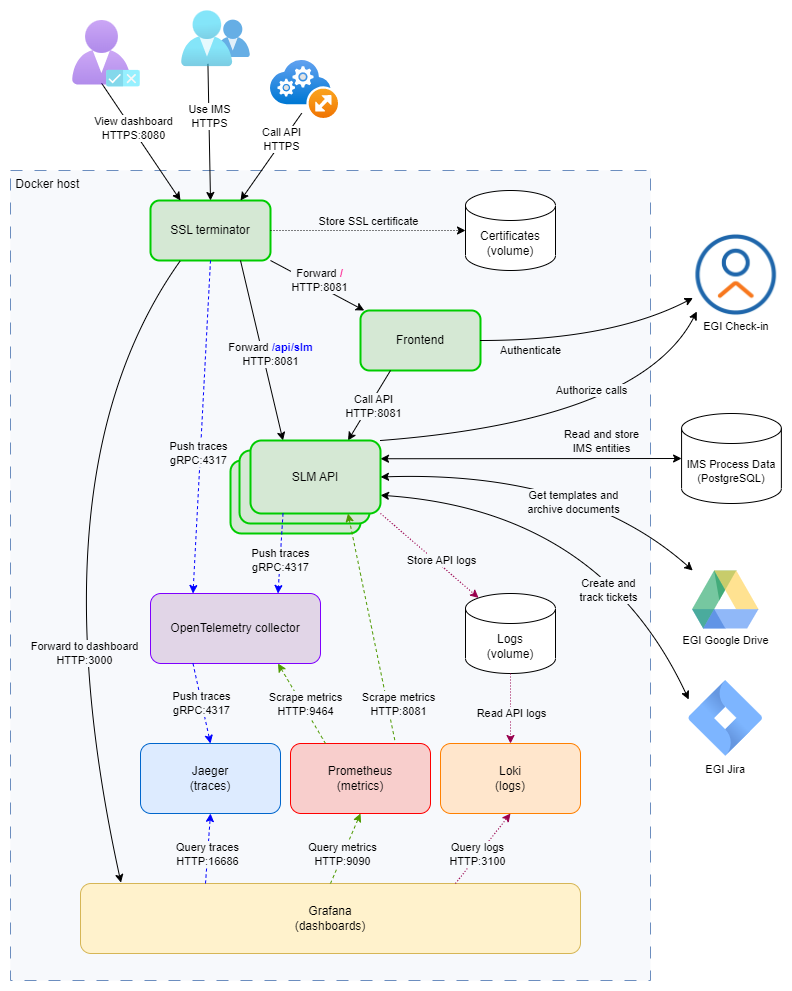

## Service architecture

The EGI IMS Tools service consists of a GUI and a collection of microservices (aka IMS modules)
that implement the APIs of the IMS processes. In front of the GUI and the APIs there
is a Nginx acting as the SSL terminator, which automatically obtains an SSL certificate
for the configured domain name of the service.

The microservices can interact with the EGI Jira ticketing system to create tickets
and to get notifications about status changes in tickets related to IMS procedures.

The microservices can also read document templates from a configured Google Drive, generate
documents (e.g. agreements, reports, etc.) based on these templates, and archive the generated
documents to the configured folders in the Google Drive.

All APIs use OpenTelemetry for observability, supported by the following components:

- OpenTelemetry collector - collects, batch processes, and forwards traces/metrics from all microservices
- Jaeger - receives traces
- Loki - receives logs
- Prometheus - scrapes metrics
- Grafana - provides dashboards for IMS processes and API telemetry

The architecture and interaction between these components is illustrated below:

<!-- markdownlint-disable no-inline-html -->

<!-- markdownlint-enable no-inline-html -->

## Authentication and authorization

TBD

## Configuration

TBD

## Running the service using Docker Compose

You can use Docker Compose to easily deploy and run the components of the EGI IMS Tools.

Steps to run the API in a container:

1. Copy the file `deploy/.env.template` to `deploy/.env`, then:
    * Provide the domain name and port where you will deploy the API in the environment
      variables `SERVICE_DOMAIN` and `SERVICE_PORT`, respectively.
    * Provide an email address in the environment variable `SERVICE_EMAIL` to be used,
      together with the domain name, to automatically request a SSL certificate for the
      SSL terminator.
    * Provide the Check-in credentials the APIs will use to reconfigure access of users to
      IMS areas/features: the username in environment variable `EGI_CKECKIN_USERNAME`
      and the password in variable `EGI_CKECKIN_PASSWORD`.
    * TODO Configure the DB
    * TODO Configure Jira
    * TODO Configure Google Drive
    * In the environment variable `TELEMETRY_PORT` provide the port on which to publish
      the Grafana telemetry dashboard. This will be available on the same domain name as
      the GUI and the APIs.

2. Run the command `build.sh` (or `build.cmd` on Windows) to build and run the containers.

3. The SSL terminator will automatically use [Let's Encrypt](https://letsencrypt.org)
   to request an SSL certificate for HTTPS.

After the SSL terminator container is deployed and working properly, connect to it and
make sure it is requesting an actual HTTPS certificate. By default, it will use a self-signed
certificate and will only do dry runs for requesting a certificate to avoid the
[rate limits](https://letsencrypt.org/docs/rate-limits/) of Let's Encrypt. To do this:

- Run the command `sudo docker exec -it data-transfer-ssl /bin/sh` then
- In the container change directory `cd /opt`
- Edit the file `request.sh` and remove the `certbot` parameter `--dry-run`

> In case you remove the containers of the EGI IMS Tools service, retain the volume `certificates`,
> which contains the SSL certificate. This will avoid requesting a new one for the same domain,
> in case you redeploy the service (prevents exceeding Let's Encrypt rate limit).
